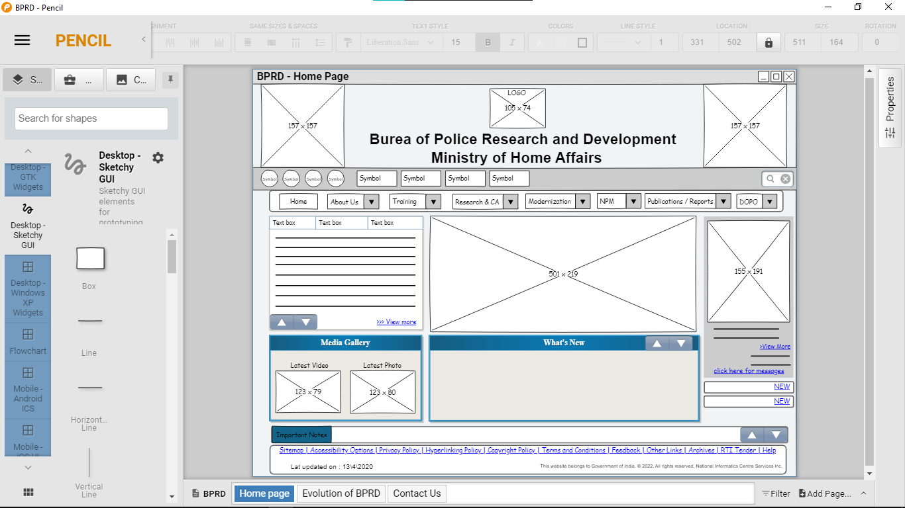
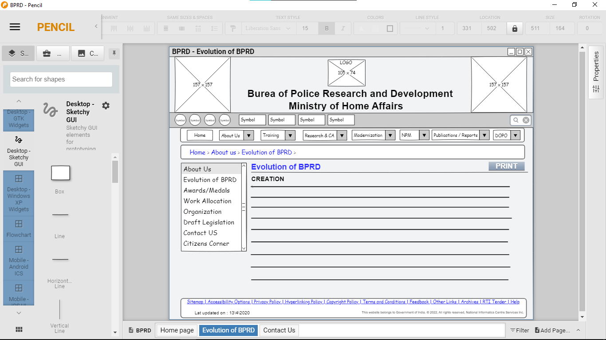
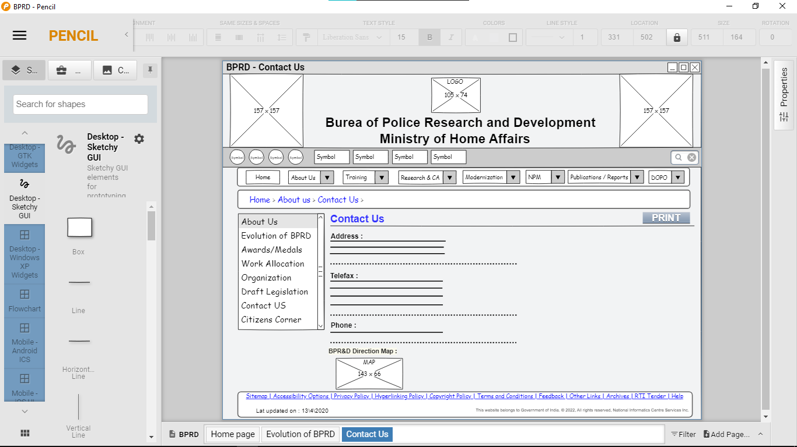

# Wire frame for a website

## AIM:
To design a wire frame for a website.

## DESIGN STEPS:

### Step 1:
Open a New Document and resize the canvas to your desired size. 

### Step 2:
Use the tools to design a Wire frame for the given website.

## Step 3:
Duplicate tha layout and modify the further pages.

## Step 4:
Save the pages once you're done.

## OUTPUT:
### Home Page :

### Evolution of BPRD :

### Contact Us :

## Result:
Thus a wire frame is designed for a given website.
